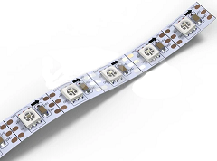
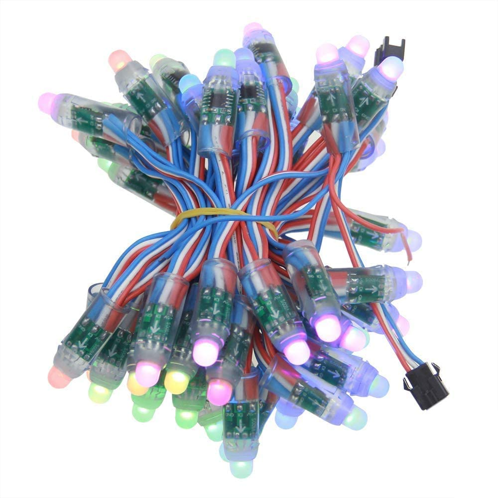
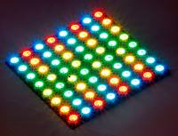
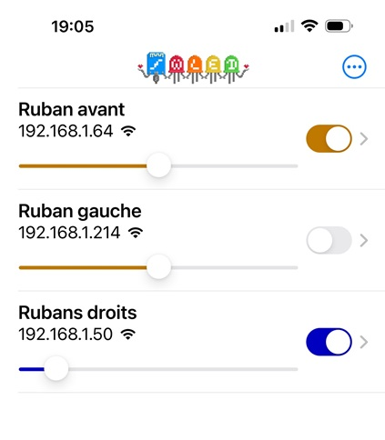

Description
===

Plugin permettant de contrôler des led adressables via le contrôleur WLED.

Mais tout d'abord il faut préciser ce que sont les led adressables qu' on trouve sous forme 

- de ruban,

- de "guirlande" (parfait pour un éclairage extérieur de Noël en mettant alimentation et contrôleur dans un coffret étanche)

- ou de panneau (matrice)

Ce sont des led où chaque led (ou plus rarement groupe de 2 ou 3 leds) possède son petit contrôleur qui permet de la commander individuellement.
On peut donc faire de très jolis effets puisque le côntroleur va pouvoir commander l'allumage, la luminosité ou la couleur de chaque led.

On peut les contrôler avec par exemple un contrôleur WifI comme le SP108E qu’on trouve sur Amazon, eBay, Aliexpress, … pour lequel il existe des app Android et IOS.

Si j’ai correctement lu la doc des différents plugins Jeedom que j’ai trouvé aucun ne gère ce type de contrôleur (mais j’ai peut-être mal lu).

Mais ce qui m'a spécialement intéressé c'est qu'il existe un fantastique contrôleur Wifi nommé WLED qu'on peut implanter sur un ESP8266 ou ESP32 (par exemple un Wemos ou un NodeMCU) qui permet de commander ces leds.

Vous pouvez consulter [le dépot Github de WED](https://github.com/Aircoookie/WLED) et [son wiki](https://github.com/Aircoookie/WLED/wiki)

Sachant que ce contrôleur possède une API très riche qui permet de communiquer avec lui par des requêtes JSON ou HTTP, j'ai décidé de faire un plugin pour interfacer ce contrôleur avec Jeedom

Bon assez de généralités. Pour débuter il vous faut

- des leds par exemple un ruban ou une guirlande avec des leds WS2812B ou WS2811 ou SK6812 ou WS2801 ou APA102
- un ESP8266 ou ESP32 avec le programme WLED téléchargé dessus et configuré pour votre réseau Wifi et vos leds. Je ne m'étendrai pas sur comment faire, il existe de multiples tutos et vidéos YouTube qui expliquent cela
- en option plutôt qu'un circuit "nu" ou bricolé sur une plaque je me permet de vous recommander le contrôleur [Dig Uno de Quinled](https://quinled.info/2018/09/15/quinled-dig-uno/) dont les dernières versions permettent de contrôler 2 rubans qui apparaîtront comme 2 segments (et son grand frère Dig Quad qui peut contrôler 4 rubans). Il offre plusieurs avantages : il y a un fusible protecteur, il gère les tensions 5V et 12V, il y a un level shifter qui permet d'avoir un cable plus long entre le contrôleur et la première led sans que le signal ne se détériore,...

Ce contrôleur peut être acheté tout fait, [voir la page](https://quinled.info/2020/02/11/quinled-dig-uno-pre-assembled-available/) ou le monter vous-même, on peut dans ce cas acheter juste le circuit imprimé chez DirtyPCB ou PCBWay et les composants, [voir les infos ici](https://quinled.info/2020/05/08/quinled-dig-uno-hardware-guide-2/) ceci dit cela n'est intéressant financièrement que si vous prévoyez d'en monter une série.

Il existe aussi une version  avec 4 sorties (Quinled Dig Quad).

Je vous conseille avant de vous lancer dans le plugin d'installer l'application WLED sur votre smartphone Android ou IOS et de vérifier que tout est OK que vous arrivez bien à commander vos leds. Cela vous permettra aussi de connaître l'adresse IP de votre ruban sur votre réseau local.

Note : le plugin fonctionne en local sur votre réseau Wifi. il est totalement indépendant du web.

Configuration du plugin
===

Rien de spécial il suffit juste d'installer le plugin comme n'importe quel plugin Jeedom et de l'activer

Création des équipements
===

## Découverte des équipements par scan du réseau local

Vous pouvez cliquer sur le bouton Découverte et le plugin scannera votre réseau local à la recherche des contrôleurs Wled. Pour chaque équipement il récupérera l'adresse IP et le nom. Il ne vous restera plus qu'à les placer dans la pièce de votre choix pour pouvoir les utiliser. Par défaut l'intervalle d'actualisation est initialisé à "toutes les minutes" mais vous pouvez le changer.

Si dans l'appli smartphone (ou dans l'interface web) vous avez défini plusieurs segments, un objet Jeedom sera créé pour chaque segment.
Pour le segment principal (segment 0), il y a des commandes supplémentaires (Ruban on, Ruban off et Luminosité globale) qui agissent sur toutes les leds branchées sur le contrôleur situé à cette IP (et il faut noter que la commande Ruban off réinitialise les effets pour tous les segments). Toutes les autres commandes agissent sur le segment concerné uniquement.

## Création manuelle des équipements

Vous pouvez aussi créer un équipement manuellement en cliquant sur le bouton "+".

Pour chaque équipement en plus des informations habituelles communes à tous les équipements dans les plugins Jeedom, vous devez préciser

- l'adresse IP du contrôleur (en général sous la forme 192.168.x.x)
- le numéro du segment (0 pour le segment principal qui comprends toutes les leds)
- l'intervalle de rafraîchissement (auto-actualisation) des informations de l'équipement sous la forme d'une expression cron. N'hésitez pas à cliquer sur le petit bouton ? à droite si vous n'êtes pas familier avec les expressions cron et l'assistant fera le boulot pour vous.

Sauvegardez. Voila c'est fini.

Commandes
===

Commandes propres au segment 0 (segment principal)
===

Le segment 0 possède des commandes supplémentaires globales.
Ces commandes agissent sur la totalité du ou des équipements reliés à ce contrôleur WLED (donc sur tous les segments).

Ruban on, Ruban off et Ruban luminosité sont équivalentes au bouton et au curseur de la page d'accueil de l'application smartphone. 

| Nom                                  | Type    | Sous type  | Rôle                                                                                                                                                               |
| :--:                                 | :---:   | :---:      | :---:                                                                                                                                                              |
| **Ruban on**                         | action  | autre      | Allume toutes les leds de tous les segments contrôlés par ce contrôleur WLED.                                                                                      |
| **Ruban off**                        | action  | autre      | Éteint toutes les leds de tous les segments contrôlés par ce contrôleur WLED.                                                                                      |
| **Ruban état**                       | info    | binaire    | Indique si l'équipement de ce contrôleur WLED est allumé ou éteint.                                                                                                |
| **Ruban luminosité**                 | action  | curseur    | Règle la luminosité( min = 0, max =255) tous les segments contrôlés par ce contrôleur WLED.                                                                        |
| **Ruban état luminosité**            | info    | numerique  | Valeur de la luminosité entre 0 et 255.                                                                                                                            |
| **Preset**                           | action  | liste      | Preset par son nom (la liste est récupérée sur le contrôleur et varie donc suivant les presets créés)                                                              |
| **Etat preset**                      | info    | numerique  | Numéro du preset actif                                                                                                                                             |
| **Preset par numéro**                | action  | message    | Applique un preset donné par son numéro de 1 à 250 ou plus complexe entre double quotes " " (Voir ci-dessous)                                                      |
| **Enregister preset**                | action  | message    | Enregiste l'état actuel dans le preset ayant ce numéro (de 1 à 250)                                                                                                |

On trouve aussi ici les comandes relatives aux presets (y compris les playlists) qui s'appliquent à tous les segments.

Commandes sur chaque segment
===

| Nom                                  | Type    | Sous type  | Rôle                                                                                                                                                               |
| :--:                                 | :---:   | :---:      | :---:                                                                                                                                                              |
| **On**                               | action  | autre      | Allume le segment.                                                                                                                                                 |
| **Off**                              | action  | autre      | Éteint le segment.                                                                                                                                                 |
| **Etat**                             | info    | binaire    | Indique si le segment est allumé ou éteint.                                                                                                                        |
| **Luminosité**                       | action  | curseur    | Règle la luminosité( min = 0, max =255) du segment.                                                                                                                |
| **Etat Luminosité**                  | info    | numerique  | Valeur de la luminosité du segment entre 0 et 255.                                                                                                                 |
| **Couleur**                          | action  | couleur    | Couleur principale (RVB, pour le moment le plugin ne gère pas les leds RVBW)                                                                                       |
| **Etat couleur**                     | info    | chaine     | Valeur hexadécimale de la couleur principale RVB.                                                                                                                  |
| **Couleur Bg**                       | action  | couleur    | Couleur secondaire (RVB, pour le moment le plugin ne gère pas les leds RVBW)                                                                                       |
| **Etat couleur Bg**                  | info    | chaine     | Valeur hexadécimale de la couleur secondaire RVB.                                                                                                                  |
| **Couleur Third**                    | action  | couleur    | Troisième couleur (RVB, pour le moment le plugin ne gère pas les leds RVBW)                                                                                        |
| **Etat couleur Third**               | info    | chaine     | Valeur hexadécimale de la troisième couleur RVB.                                                                                                                   |
| **Effet**                            | action  | liste      | Effet (la liste est récupérée sur le contrôleur et peut donc varier suivant la version de WLED)                                                                    |
| **Etat effet**                       | info    | numerique  | Numéro de l'effet actif                                                                                                                                            |
| **Nom effet**                        | info    | chaine     | Nom de l'effet (récupéré sur le contrôleur et peut donc varier suivant la version de WLED)                                                                         |
| **Vitesse effet**                    | action  | curseur    | Vitesse de l'effet (min = 0 est le plus lent, max = 255 est le plus rapide)                                                                                        |
| **Etat vitesse effet**               | info    | numerique  | Valeur de la vitesse de l'effet entre 0 et 255                                                                                                                     |
| **Intensité effet**                  | action  | curseur    | Intensité de l'effet (le résultat est variable suivant l'effet pour certains effets cette commande ne fait rien)                                                   |
| **Etat intensité effet**             | info    | numerique  | Valeur de l'intensité de l'effet                                                                                                                                   |
| **Palette**                          | action  | liste      | Palette (la liste est récupérée sur le contrôleur et peut donc varier suivant la version de WLED)                                                                  |
| **Etat effet**                       | info    | numerique  | Numéro de la palette active                                                                                                                                        |
| **Nom palette**                      | info    | chaine     | Nom de la palette active (récupéré sur le contrôleur et peut donc varier suivant la version de WLED)                                                               |
| **Effet par nom**                    | action  | message    | Applique l'effet ayant ce nom (s'il existe, sinon ne fait rien)                                                                                                    |
| **Palette par nom**                  | action  | message    | Applique la palette ayant ce nom (si elle existe, sinon ne fait rien)                                                                                              |
| **Effet par numéro**                 | action  | message    | Applique l'effet ayant ce numéro (s'il existe, sinon ne fait rien)                                                                                                 |
| **Palette par numéro**               | action  | message    | Applique la palette ayant ce numéro (si elle existe, sinon ne fait rien)                                                                                           |

Utilisation de la commande action **Preset par numéro** sur le segment 0.
===

Il faut taper dans le champ Preset soit un numéro de preset à appliquer entre 1 et 250 soit par exemple `"1~4~"` pour enchaîner les preset entre 1 et 4 ou encore `"4~10~r"` pour choisir au hasard un preset entre 4 et 10 compris.